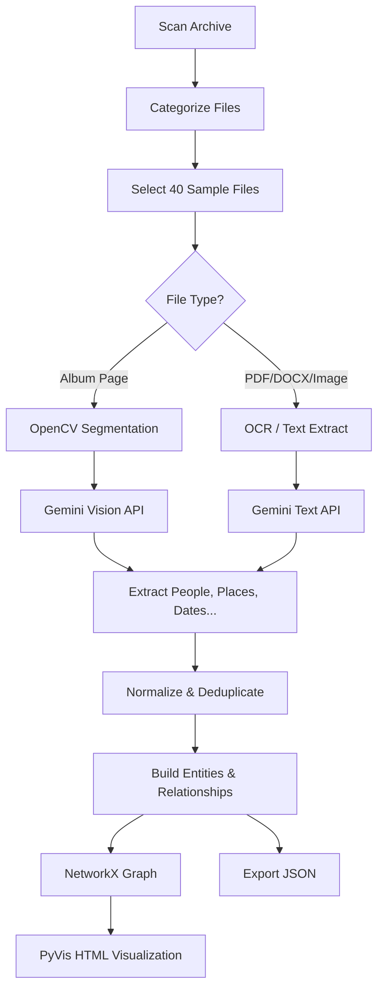

# Martiny Family Archive – Multimodal Knowledge Graph Builder  
   

A **prototype pipeline** that extracts entities (people, places, companies, events, etc.) and relationships from a heterogeneous historical archive (photos, scanned PDFs, DOCX, newspapers) using **Computer Vision**, **OCR**, and **Google Gemini AI (multimodal)**.  

It builds a **Knowledge Graph** and exports:
- `entities.json`
- `relationships.json`
- `knowledge_graph.html` (interactive visualization)
- `file_catalog.csv`, `statistics.json`, `validation_report.json`

---

## Features

| Feature | Description |
|--------|-------------|
| **Archive Scanning** | Recursively indexes all files with categorization |
| **Stratified Sampling** | Processes 40 representative files (covers all types) |
| **Album Page Segmentation** | Splits multi-photo pages using OpenCV |
| **OCR (Italian)** | PaddleOCR with rotation correction |
| **Multimodal AI** | Gemini 1.5 Flash (Vision + Text) for entity extraction |
| **Entity Deduplication** | Fuzzy matching + normalization (handles "F. Martiny" = "Francesco Martiny") |
| **Knowledge Graph** | NetworkX + PyVis interactive HTML |
| **Structured Export** | JSON files ready for Neo4j, GraphDB, etc. |

---

## Folder Structure (Expected)

```
ARCHIVE_ROOT/
├── Album Foto/
├── Articoli di giornale/
├── Certificati/
├── Fotografie di famiglia/
├── Lettere/
├── Commerciali/
├── Genealogia/
└── ...
```

> Set `ARCHIVE_PATH` in `.env` to this root folder.

---

## Setup Instructions (Windows 10)

### 1. Prerequisites

| Tool | Version |
|------|--------|
| Python | **3.11.9** |
| Git | Latest |
| Windows 10 / 11 | 64-bit |

> **Download Python 3.11.9**:  
> https://www.python.org/downloads/release/python-3119/

---

### 2. Clone the Repository

git clone https://github.com/yourusername/martiny-knowledge-graph.git
cd martiny-knowledge-graph


# Create Virtual Environment

```bashpython -m venv venv
venv\Scripts\activate
```

## Install Dependencies
```bash
pip install -r requirements.txt
```


## Setup .env File
Create a .env file in the project root:
env# .env
```bash
GEMINI_API_KEY=your_gemini_api_key_here
ARCHIVE_PATH=C:/path/to/your/archive/root
OUTPUT_DIR=./output
PROTOCOL_BUFFERS_PYTHON_IMPLEMENTATION=python
```


## Run the Notebook
Option A: Jupyter Lab (Recommended)
bashpip install jupyterlab
jupyter lab

## Output Files (Generated in ./output/)

| File | Description |
|------|-------------|
| **knowledge_graph.html** | Interactive graph – open in browser |
| **entities.json** | All extracted entities |
| **relationships.json** | All relationships |
| **file_metadata.json** | Provenance + OCR preview |
| **file_catalog.csv** | Full archive index |
| **statistics.json** | Summary stats |
| **validation_report.json** | Quality checks |


## Pipeline Overview




## 🔍 Free-Tier vs Paid Gemini API – Output Comparison

To demonstrate the difference between the **Free-Tier Gemini API** and the **Paid Gemini API**,  
I processed the **same 40-file subset** using both models and captured the results.

Below are the visual differences in:

- Number of extracted entities  
- Number of relationships  
- Accuracy of detected people/places  
- Graph richness  
- OCR + multimodal understanding quality  

---

### 📸 Visual Comparison (Side-by-Side)

<table>
  <tr>
    <th style="text-align:center;">Free-Tier Gemini API Output</th>
    <th style="text-align:center;">Paid Gemini API Output</th>
  </tr>
  <tr>
    <td>
      
    </td>
    <td>
      
    </td>
  </tr>
  <tr>
    <td align="center"><i>Free-tier graph (fewer nodes/edges)</i></td>
    <td align="center"><i>Paid model graph (denser and more accurate)</i></td>
  </tr>
</table>

---

### 📈 Statistical Comparison

| Metric | Free-Tier API | Paid API | Improvement |
|--------|--------------|----------|-------------|
| **Entities Extracted** | ~7–12 | ~35–60 | 🔼 4–5× |
| **Relationships** | 1–3 | 40–70 | 🔼 20–60× |
| **People Detected in Photos** | Very few | Consistently extracted | ✔ |
| **Place & Object Detection** | Weak | Strong | ✔ |
| **OCR Quality** | Often incorrect | High quality | ✔ |
| **Contextual Understanding** | Poor | Excellent | ✔ |

---

### 🧠 Summary

- The **Free-Tier Gemini model** produced *very sparse* results:  
  Only 1–3 relationships across the entire sample and weak entity detection.

- The **Paid Gemini 2.5 Flash and Pro model** produced *complete and rich structured outputs*:  
  Multiple entity groups, place detection, product mentions, scene analysis, and strong OCR.

This difference justifies using the **Paid Gemini API** for production-quality multimodal knowledge extraction.

---


### 📝 Conclusion

The **paid Gemini model is more accurate and capable** if your goal is:

- Reliable multimodal extraction  
- Consistent relationship detection  
- Accurate knowledge graph building  
- Production-grade historical archive analysis  


## Future Extensions

- Face recognition clustering (group same person across photos)
- Timeline view (D3.js)
- Neo4j import script
- Web UI (Streamlit/FastAPI)
- Audio transcription (optional)

